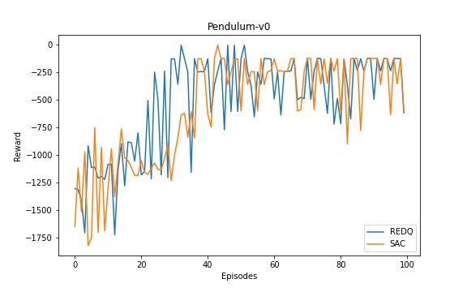

# Randomized-Ensembled-Double-Q-learning-REDQ-

PyTorch implementation of Randomized-Ensembled-Double-Q-learning-REDQ.
This repo contains a [notebook](https://github.com/BY571/Randomized-Ensembled-Double-Q-learning-REDQ-/blob/main/REDQ-notebook.ipynb) version and a script version to run REDQ or SAC.

For more information about REDQ check out the [paper](https://openreview.net/pdf?id=AY8zfZm0tDd) or checkout my [medium article](https://medium.com/analytics-vidhya/randomized-ensembled-double-q-learning-learning-fast-without-a-model-11b25e2fc3a8) about it.
In the future I will add REDQ to my [Soft-Actor-Critic-and-Extensions](https://github.com/BY571/Soft-Actor-Critic-and-Extensions) repository so you can combine it with several other performance increasing extensions like PER, D2RL or Munchausen RL.
#### Dependencies
Trained and tested on:
<pre>
Python 3.6
PyTorch 1.7.0  
Numpy 1.15.2 
gym 0.10.11 
pybulletgym
</pre>

## How to use:
The new script combines all extensions and the add-ons can be simply added by setting the corresponding flags.

`python train.py -info redq`

### Results

REDQ trained with N=5,M=2,G=5 (REDQ actually recommends 10,2,20) However, for faster training I trained with the adapted parameters. If someone finds a way to speed up training please let me know. with N=10, G=20 it takes ~ 10x longer when compared to regular SAC.



### ToDos:

- Currently this REDQ version supports only a subsample size of 2 for the REDQ hyperparameter M, however, this repository will be updated over time.
- Do comparison runs for REDQ and SAC
- add requirements.txt


## Author
- Sebastian Dittert

**Feel free to use this code for your own projects or research.**
```
@misc{REDQ,
  author = {Dittert, Sebastian},
  title = {PyTorch Implementation of Randomized-Ensembled-Double-Q-learning-REDQ-},
  year = {2020},
  publisher = {GitHub},
  journal = {GitHub repository},
  howpublished = {\url{https://github.com/BY571/Randomized-Ensembled-Double-Q-learning-REDQ-}},
}
```  

